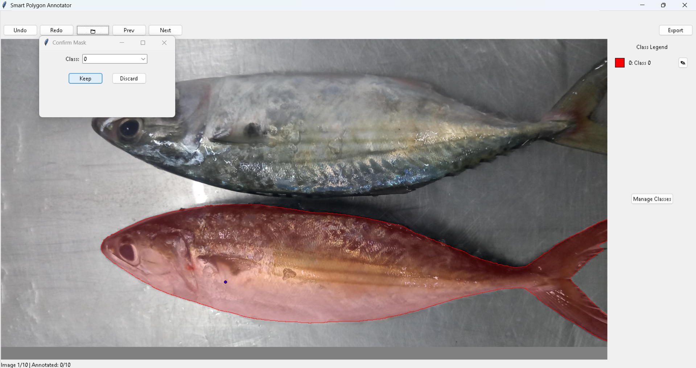

# Smart Polygon Annotator

**Smart Polygon Annotator** is an interactive tool for creating polygon-based annotations for object segmentation. It integrates with Meta’s [Segment Anything Model (SAM)](https://github.com/facebookresearch/segment-anything) to generate masks from user clicks, then exports those masks in **YOLOv8 segmentation** format.

---

## Table of Contents
- [Features](#features)
- [Requirements](#requirements)
- [Installation](#installation)
- [Usage](#usage)
- [Project Structure](#project-structure)
- [Exporting the YOLOv8 Dataset](#exporting-the-yolov8-dataset)
- [Notes and Future Enhancements](#notes-and-future-enhancements)
- [License](#license)

---

## Features

## Features

1. **Interactive Annotation**  
   - Click on an image to generate a mask automatically using SAM.
   - Preview the mask, accept or discard it, and store multiple annotations per image.

2. **Polygon + Bounding Box Storage**  
   - Each accepted mask is stored as a set of polygon points and a bounding box in the application’s memory.

3. **Different Mask Colors**  
   - Each mask is assigned a unique color for better visualization of multiple objects in the image.

4. **One-Click YOLOv8 Export**  
   - Automatically splits the dataset into `train`, `val`, and `test` sets.
   - Creates YOLOv8 segmentation labels with normalized polygon coordinates.
   - Generates a `data.yaml` for easy YOLOv8 training.

5. **Multi-Class Support**  
   - Allows users to annotate and classify multiple object classes within the same image.

6. **Zoom In & Out**  
   - Users can zoom in and out on images using the mouse scroll button for precise annotations.

7. **Undo & Redo**  
   - Undo or redo the last annotation action to correct mistakes efficiently.

---

## Requirements

- **Python 3.9**
- **Tkinter** (usually ships with standard Python on most OS; otherwise install appropriate system packages)
- **PyTorch** (with or without CUDA, depending on your system)
- **segment_anything** (SAM from [GitHub repo](https://github.com/facebookresearch/segment-anything))
- **numpy**, **opencv-python**, **Pillow**, **scikit-learn** (for image processing, manipulation, dataset splitting)
- **yaml** (usually installed via `PyYAML`) if not already present

### Downloading SAM Checkpoints
To use the Segment Anything Model (SAM), you need to download the official model checkpoints from the [official Meta webpage](https://github.com/facebookresearch/segment-anything#model-checkpoints). Place the downloaded `.pth` files in the appropriate directory before running the application.

Example installation (assuming a virtual environment):

```bash
pip install torch torchvision torchaudio --index-url https://download.pytorch.org/whl/cu118 #For Cuda
```

*(Adjust torch versions/index URL for your CUDA setup.)*

---

## Installation

1. **Clone** this repository:
   ```bash
   git clone https://github.com/Kartik-A-1820/SmartAnnotator.git
   cd SmartAnnotator
   ```

2. **Install dependencies** via pip:
   ```bash
   pip install -r requirements.txt
   ```
   or manually install the packages listed under [Requirements](#requirements).

3. **Download SAM model checkpoints** as mentioned in the section above and place them in the project directory.

---

## Usage

1. **Launch the GUI**:
   ```bash
   python app.py
   ```
   A Tkinter window titled “Smart Polygon Annotator” will appear.

2. **Upload Images**:
   - Click **“Upload Images”** to select multiple image files (`.jpg`, `.jpeg`, `.png`).
   - The first image appears on the canvas.

   

3. **Annotate**:
   - **Left-click** on a region of the image where you want to generate a mask.
   - A mask is generated automatically (using the SAM model).
   - A confirmation dialog appears—choose **“Keep”** or **“Discard”** for the mask.

   

4. **Navigate Images**:
   - Click **“Previous”** or **“Next”** to cycle through images.

5. **Export Dataset**:
   - Once you’re done annotating, click **“Export Dataset”**.
   - Choose an **export directory** to store your YOLOv8-style dataset.
   - The script splits your images into `train`, `val`, and `test` folders and places corresponding `.txt` label files under `labels/`.

   

---

<p align="center"><strong>Happy Annotating!</strong></p>
